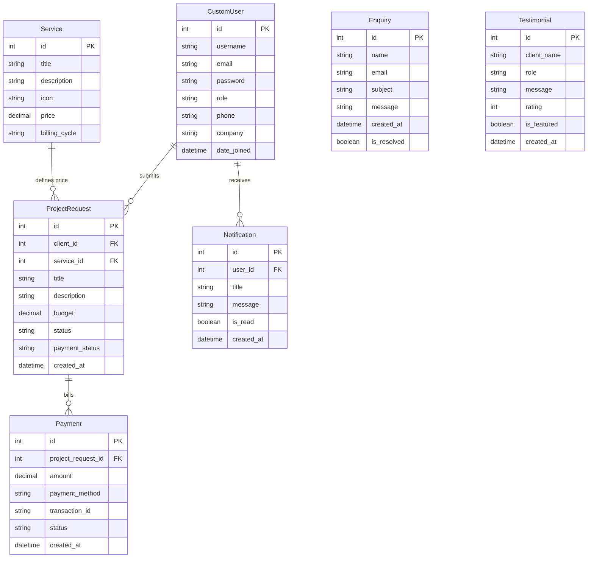

# Database Schema Specifications

This document outlines the database structure, tables, types, and entity relationships implemented in the Django backend.

## Entity Relationship Diagram

---

## Detailed Table Specifications

### 1. `accounts_customuser` (Inherits from AbstractUser)
Stores user accounts, authentication states, and dashboard roles.

| Field Name | Type | Constraints | Description |
| :--- | :--- | :--- | :--- |
| `id` | Integer | Primary Key, Auto-increment | Unique identifier |
| `username` | Varchar(150) | Unique, Not Null | Account handle |
| `email` | Varchar(254) | Not Null | Contact email |
| `role` | Varchar(20) | Default: `'client'` | Choices: `'client'`, `'staff'`, `'admin'` |
| `phone` | Varchar(20) | Nullable | Contact number |
| `company` | Varchar(100) | Nullable | Client company name |

### 2. `services_service`
Stores service packages and starting prices.

| Field Name | Type | Constraints | Description |
| :--- | :--- | :--- | :--- |
| `id` | Integer | Primary Key, Auto-increment | Unique identifier |
| `title` | Varchar(100) | Not Null | Service name |
| `description` | Text | Not Null | Scope parameters |
| `icon` | Varchar(50) | Default: `'Layers'` | Lucide react icon slug |
| `price` | Decimal(10,2) | Not Null | Package rate |
| `billing_cycle` | Varchar(20) | Default: `'one_time'` | Choices: `'one_time'`, `'monthly'`, `'annual'` |

### 3. `projects_projectrequest`
Tracks client submissions for customized workspaces.

| Field Name | Type | Constraints | Description |
| :--- | :--- | :--- | :--- |
| `id` | Integer | Primary Key, Auto-increment | Unique identifier |
| `client_id` | Integer | Foreign Key (`accounts_customuser`) | Request owner |
| `service_id` | Integer | Foreign Key (`services_service`), Nullable | Base package reference |
| `title` | Varchar(150) | Not Null | Project title |
| `description` | Text | Not Null | Details and requirements |
| `budget` | Decimal(12,2) | Not Null | Estimated budget |
| `status` | Varchar(20) | Default: `'pending'` | Choices: `'pending'`, `'in_progress'`, `'completed'`, `'cancelled'` |
| `payment_status`| Varchar(20) | Default: `'unpaid'` | Choices: `'unpaid'`, `'paid'` |

### 4. `payments_payment`
Stores financial invoices and transaction hashes.

| Field Name | Type | Constraints | Description |
| :--- | :--- | :--- | :--- |
| `id` | Integer | Primary Key, Auto-increment | Unique identifier |
| `project_request_id` | Integer | Foreign Key (`projects_projectrequest`) | Billed project request |
| `amount` | Decimal(10,2) | Not Null | Bill value |
| `payment_method` | Varchar(50) | Default: `'Stripe'` | Processor handle |
| `transaction_id` | Varchar(100)| Unique, Not Null | Gate processor hash |
| `status` | Varchar(20) | Default: `'pending'` | Choices: `'pending'`, `'completed'`, `'failed'` |
